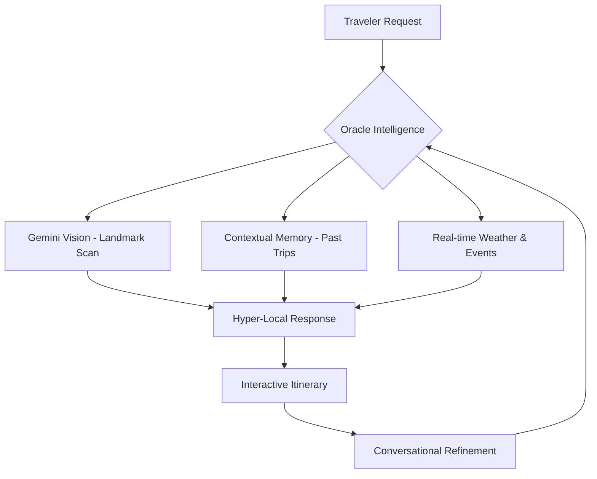
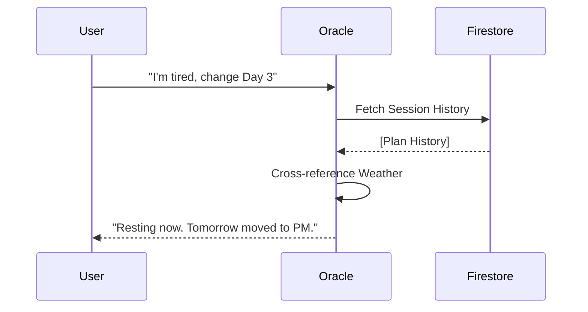

---
## 🎨 The Technical Blueprint (Visual Plan)

## 1. Multimodal Vision (Real Recognition)
Currently, Oracle Vision is a simulated hardware layer.
- **Goal:** Integration with Gemini 1.5 Pro (Vision).
- **Impact:** Users take a photo of a temple inscription or a random landscape in Nuwara Eliya, and the Oracle identifies it, provides local folklore, and suggests the nearest cup of Ceylon tea.

## 2. Conversational Itinerary Refinement (Stateful Memory)

- **Goal:** Stateful chat sessions for each trip plan.
- **Impact:** "Oracle, I'm feeling tired after the Sigiriya climb. Can we reschedule the museum for tomorrow morning and find a quiet cafe now?"

## 3. Real-Time Geo-Event Grounding
Currently, we ground in static weather and transit facts.
- **Goal:** Live Event API integration (Poya days, Cricket matches, Local Festivals).
- **Impact:** "Aayubowan! You're landing during the Esala Perahera. I've adjusted your Kandy route to avoid road closures and secured a viewing spot."

## 4. Hyper-Local "Vibe" Intelligence
- **Goal:** Integration with social media trending data (Instagram/TikTok sentiment analysis).
- **Impact:** Prioritizing "hidden" spots that are currently trending but not yet in traditional guidebooks.

## 5. Voice Synthesis & Emotional AI
- **Goal:** Custom voice training using authentic Sri Lankan English/Sinhala accents.
- **Impact:** A truly localized voice guide that feels like talking to a friend, not a machine.

---
**Verdict:** Category-defining apps are led by **Context**. The more hardware (Camera) and live data (Events) we feed the Oracle, the more indispensable it becomes.
